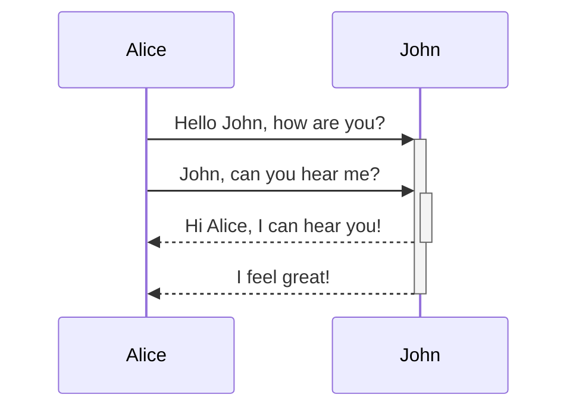
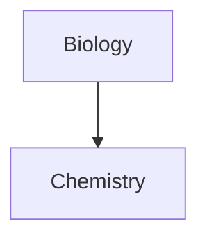
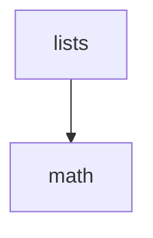

# Diagrams

---

## Sequence

```mermaid
sequenceDiagram
    Alice->>+John: Hello John, how are you?
    Alice->>+John: John, can you hear me?
    John-->>-Alice: Hi Alice, I can hear you!
    John-->>-Alice: I feel great!
```

## Graph

```mermaid
graph TD

Biology --> Chemistry
```

## Linked files in a diagram

## Direct

```mermaid
graph TD

lists --> math

class lists,math internal-link;
```

## Proxy

```mermaid
graph TD

A[lists]
B[math]

A --> B

class A,B,C,D,E,F,G,H,I,J,K,L,M,N,O,P,Q,R,S,T,U,V,W,X,Y,Z internal-link;
```
